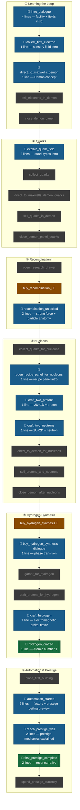

# Tutorial Flow

Blue = dialogue fires | Dark = hint text only | Orange = research gate | Green = milestone

```mermaid
flowchart TD
    classDef dlg     fill:#1a5c8a,color:#fff,stroke:#0f3d5e
    classDef silent  fill:#3a3a3a,color:#888,stroke:#555
    classDef gate    fill:#8a4a00,color:#fff,stroke:#5e3200
    classDef win     fill:#1a6e40,color:#fff,stroke:#0f4d2c

    subgraph P1["① Learning the Loop"]
        s01["💬 intro_dialogue<br/>4 lines — facility + fields intro"]:::dlg
        s02["💬 collect_first_electron<br/>1 line — sensory field intro"]:::dlg
        s03["💬 direct_to_maxwells_demon<br/>1 line — Demon concept"]:::dlg
        s04[sell_electrons_in_demon]:::silent
        s05[close_demon_panel]:::silent
    end

    subgraph P2["② Quarks"]
        s06["💬 explain_quark_field<br/>2 lines — quark types intro"]:::dlg
        s07[collect_quarks]:::silent
        s08[direct_to_maxwells_demon_quarks]:::silent
        s09[sell_quarks_in_demon]:::silent
        s10[close_demon_panel_quarks]:::silent
    end

    subgraph P3["③ Recombination I"]
        s11[open_research_drawer]:::silent
        s12[buy_recombination_i 🔬]:::gate
        s13["💬 recombination_unlocked<br/>2 lines — strong force + particle anatomy"]:::dlg
    end

    subgraph P4["④ Nucleons"]
        s14[collect_quarks_for_nucleons]:::silent
        s15["💬 open_recipe_panel_for_nucleons<br/>1 line — recipe panel intro"]:::dlg
        s16["💬 craft_two_protons<br/>1 line — 2U+1D = proton"]:::dlg
        s17["💬 craft_two_neutrons<br/>1 line — 1U+2D = neutron"]:::dlg
        s18[direct_to_demon_for_nucleons]:::silent
        s19[sell_protons_and_neutrons]:::silent
        s20[close_demon_after_nucleons]:::silent
    end

    subgraph P5["⑤ Hydrogen Synthesis"]
        s21[buy_hydrogen_synthesis 🔬]:::gate
        s21d["💬 buy_hydrogen_synthesis dialogue<br/>1 line — phase transition"]:::dlg
        s22[gather_for_hydrogen]:::silent
        s23[craft_protons_for_hydrogen]:::silent
        s24["💬 craft_hydrogen<br/>1 line — electromagnetic orbital flavor"]:::dlg
        s25[["🎉 hydrogen_crafted<br/>1 line — Atomic number 1"]]:::win
    end

    subgraph P6["⑥ Automation & Prestige"]
        s26[place_first_building]:::silent
        s27["💬 automation_started<br/>2 lines — factory + prestige ceiling preview"]:::dlg
        s28["💬 reach_prestige_wall<br/>2 lines — prestige mechanics explained"]:::dlg
        s29[["🎉 first_prestige_complete<br/>2 lines — reset narrative"]]:::win
        s30[spend_prestige_currency]:::silent
    end

    s01-->s02-->s03-->s04-->s05
    s05-->s06-->s07-->s08-->s09-->s10
    s10-->s11-->s12-->s13
    s13-->s14-->s15-->s16-->s17-->s18-->s19-->s20
    s20-->s21-->s21d
    s21d-->s22-->s23-->s24-->s25
    s25-->s26-->s27-->s28-->s29-->s30
```
